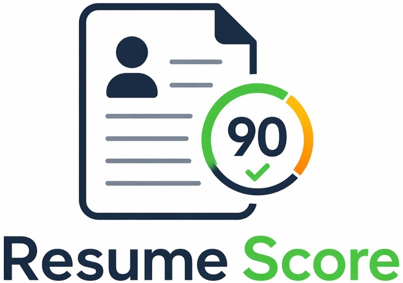

<div align="center">
  

  <h1>Resume Scoring System</h1>
  <p>
    A full-stack, JD-aware resume scoring app that compares a candidate resume with a
    target job description and returns explainable fit scores, weak sections, and rewrite signals.
  </p>

  <p>
    
    
    
    
    
    
    
  </p>
</div>

---

## What It Does

Resume Scoring System scores a resume against a specific job description, not against a vague idea of a "good resume." It blends resume structure, semantic similarity, and keyword coverage into one readable score while preserving enough detail to show what should be improved first.

| Capability | What you get |
|---|---|
| Scorecard | Overall score plus format, semantic, and keyword subscores |
| Explainability | Weak resume sections, key matching metrics, and detailed score drivers |
| Resume parsing | PDF, DOCX, PNG, JPG, JPEG, and WEBP uploads with OCR fallback for image-heavy files |
| Async scoring | Optional server-sent events flow for progress updates during scoring |
| Presets | Curated job archetype prompts from a local JSONL dataset |
| Privacy controls | In-memory uploads by default, with optional run persistence |
| Benchmarks | Hugging Face and Kaggle dataset scripts for regression checks |

## Dataset Icons

These are the data sources and artifacts used by the project for presets, benchmarking, and local learned scoring assets.

| Icon | Dataset / Artifact | Used for | Location |
|---|---|---|---|
|  | `0xnbk/resume-ats-score-v1-en` | Optional resume ATS benchmark with `text`, `ats_score`, and `original_label` columns | `backend/app/dataset_hf.py` |
|  | `mohamedramadan2040/jobsphere-ats-resume-scoring` | Optional DOCX/PDF resume corpus for smoke and score distribution checks | `backend/app/dataset_kaggle.py` |
|  | `jd_archetypes.jsonl` | Local job-description presets shown in the UI | `backend/data/jd_archetypes.jsonl` |
|  | `reference_resume.docx` | Local reference resume artifact for formatting/parsing experiments | `backend/data/reference_resume.docx` |
|  | `learned_overall.joblib` + metadata | Local learned overall-score calibration artifact | `backend/data/learned_overall.joblib` |

## How Scoring Works

The backend extracts resume text, computes multiple matching signals, and returns a normalized 0-100 score.

```text
Resume upload + Job description
          |
          v
Text extraction / OCR fallback
          |
          v
Format heuristics + semantic embeddings + keyword/BM25 signals
          |
          v
Weighted score blend + weak-section analysis + explanation payload
```

Default blend:

```text
overall = (0.18 * format + 0.50 * semantic + 0.32 * keywords) / (0.18 + 0.50 + 0.32)
```

The score channels are:

| Channel | Focus |
|---|---|
| Format and structure | Headings, scanability, section coverage, skills grouping, and resume organization |
| Semantic fit | Meaning overlap between resume text and the job description using transformer embeddings |
| Keyword fit | Important JD term coverage and BM25-style lexical relevance |

## Tech Stack

| Layer | Tools |
|---|---|
| Backend API | FastAPI, Uvicorn, Python |
| Resume parsing | `pypdf`, `python-docx`, `pypdfium2`, `pytesseract`, Pillow |
| Scoring | Sentence Transformers, scikit-learn, NumPy, rank-bm25 |
| Data access | SQLite, SQLAlchemy asyncio, aiosqlite |
| Frontend | React 18, TypeScript, Vite |
| UI | Tailwind CSS, Framer Motion, Lucide React |
| Benchmarks | Hugging Face `datasets`, KaggleHub |

## Project Structure

```text
RSS/
├─ backend/
│  ├─ app/
│  │  ├─ api/                 FastAPI routes
│  │  ├─ db/                  SQLite models, sessions, queries
│  │  ├─ services/            Scoring pipeline and async job manager
│  │  ├─ dataset*.py          Local, Hugging Face, and Kaggle dataset helpers
│  │  ├─ parsers.py           Resume text extraction
│  │  └─ scoring.py           Core scoring logic
│  ├─ data/                   Local data, caches, learned artifacts
│  ├─ benchmark_hf_resume_ats.py
│  ├─ benchmark_kaggle_jobsphere.py
│  └─ requirements.txt
├─ frontend/
│  ├─ src/
│  │  ├─ components/          Score form, results, details, recent runs
│  │  ├─ api.ts               API client helpers
│  │  └─ App.tsx              Main application shell
│  └─ package.json
├─ Makefile                   Install, build, dev, benchmark commands
└─ README.md
```

## Quickstart

### Prerequisites

- Python 3.10+
- Node.js 18+
- Optional: Tesseract OCR for scanned or image-only resumes

macOS OCR install:

```bash
brew install tesseract
```

### Install Everything

```bash
make install-all
```

### Run The App

```bash
make dev
```

The API runs at:

- App: `http://127.0.0.1:8000/`
- API docs: `http://127.0.0.1:8000/docs`
- Health: `http://127.0.0.1:8000/api/health`

### Run With Frontend Hot Reload

Terminal A:

```bash
make dev-api
```

Terminal B:

```bash
make dev-ui
```

Vite runs at `http://127.0.0.1:5173` and proxies `/api` to the backend.

## API

| Method | Endpoint | Purpose |
|---|---|---|
| `GET` | `/api/health` | Service health and active scoring weights |
| `GET` | `/api/archetypes` | Curated JD archetypes from `jd_archetypes.jsonl` |
| `POST` | `/api/score` | Synchronous resume scoring |
| `POST` | `/api/score_async` | Start async scoring job |
| `GET` | `/api/score_events/{job_id}` | Stream async scoring progress over SSE |
| `GET` | `/api/snippet/{token}.png` | Temporary snippet image generated during scoring |
| `GET` | `/api/runs` | Recent scoring runs when persistence is enabled |

`POST /api/score` expects multipart form data:

| Field | Type | Notes |
|---|---|---|
| `file` | file | PDF, DOCX, PNG, JPG, JPEG, or WEBP; max 5 MB |
| `position_title` | string | Required |
| `job_description` | string | Required; minimum 40 characters |

## Configuration

Create a repo-root `.env` file to override defaults.

```env
SCORING_WEIGHT_FORMAT=0.18
SCORING_WEIGHT_SEMANTIC=0.50
SCORING_WEIGHT_KEYWORDS=0.32

PERSIST_SCORING_RUNS=false
STORE_SCORING_SENSITIVE_CONTENT_IN_DB=false

EMBEDDING_MODEL=all-MiniLM-L6-v2
LLM_MAX_TOKENS=700
```

Run `GET /api/health` to confirm the weights currently loaded by the backend.

## Benchmarks

The benchmark scripts are useful for regression tracking when scoring logic changes. They should not be treated as absolute accuracy claims, because this app is job-description-aware and public resume datasets may not include a matching JD per row.

### Hugging Face Resume ATS

```bash
make benchmark-hf-resume
```

Equivalent direct command:

```bash
cd backend
../.venv/bin/python benchmark_hf_resume_ats.py --split validation --limit 200
```

Reports MAE and Pearson correlation between this app's `overall_score` and the dataset's `ats_score`.

### Kaggle Jobsphere

Requires Kaggle credentials for the first download:

```env
KAGGLE_USERNAME=your_username
KAGGLE_KEY=your_key
```

Run:

```bash
make benchmark-kaggle-jobsphere
```

The script scores extractable DOCX/PDF resumes and reports summary distribution statistics.

## Command Reference

```bash
make help
make install
make install-frontend
make install-all
make build
make dev
make dev-api
make dev-ui
make benchmark-hf-resume
make benchmark-kaggle-jobsphere
make clean
```

## Privacy Model

- Uploaded files are processed in memory for scoring.
- Scoring history persistence is disabled by default.
- Sensitive content storage is disabled by default even when persistence is enabled.
- Temporary snippet images are served with `Cache-Control: no-store`.

## Troubleshooting

| Problem | Fix |
|---|---|
| Very little text extracted | Use a text-based PDF/DOCX, or install Tesseract for scanned resumes |
| OCR unavailable | Ensure the `tesseract` binary is installed and available on `PATH` |
| Frontend cannot reach backend | Use `make dev`, or run `make dev-api` and `make dev-ui` together |
| Hugging Face dataset download is slow | The cache is kept under `backend/data/hf_datasets_cache` |
| Kaggle download fails | Check `KAGGLE_USERNAME` and `KAGGLE_KEY` |
| Changed `.env` but behavior is unchanged | Restart the backend so settings reload |

## Why Scores Can Surprise You

A strong resume can still score low if it does not match the specific job description. This is intentional. The app rewards evidence that the resume mirrors the target role: relevant tools, domains, responsibilities, seniority signals, and outcomes. Use the weak-section output as the first rewrite queue.

